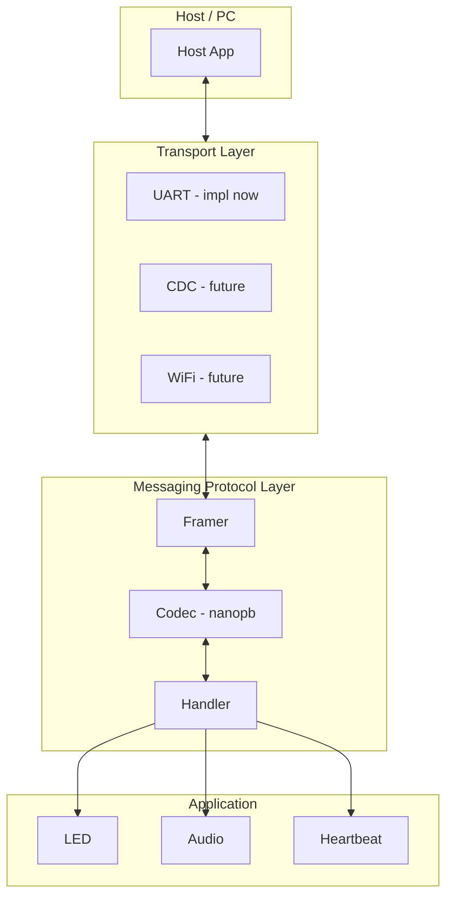

# Messaging Protocol Architecture

## Current State

- **messaging_protocol.proto** (currently ash7.proto) defines `Frame` as the single wire envelope with `oneof` for Heartbeat, LogMessage, GenericRequest/Response, and AudioStream* messages
- **STM32H7 dual-core**: CM4 runs app (display, led, heartbeat, dlog, touch); CM7 handles system init
- **UART**: USART3 via `uart_driver` (queue TX, stream RX, 128B max msg)
- **USB CDC**: Present in CubeMX but not enabled/used; will add later
- **No protobuf** integration yet; `generated/` is a placeholder

---

## 1. Codegen Strategy

### Embedded (STM32): Nanopb

**Why nanopb**: Lightweight ANSI C, designed for MCUs. Full protobuf is too large for STM32 flash/RAM.

### Host (optional)

If you need PC/Python/Rust host tools: use standard protoc; keep `messaging_protocol/` as the single source of truth.

---

## 2. Project Structure (Senior-Engineer Layout)

**Implementation scope**: UART only. Transport interface is designed for CDC/WiFi; add those when needed.

```
audio-system-h7/
├── messaging_protocol/               # Proto definitions (rename from proto/)
│   ├── messaging_protocol.proto      # Single source of truth (portable, no nanopb imports)
│   └── messaging_protocol.options    # Nanopb field-size constraints (nanopb-specific)
├── third_party/
│   └── nanopb/                       # Git submodule, tag 0.4.9
├── generated/
│   ├── CMakeLists.txt                # Compiles pre-generated .pb.c + nanopb runtime
│   └── messaging_protocol/           # Output of `make codegen` (or scripts/gen-proto.sh)
│       ├── messaging_protocol.pb.c
│       └── messaging_protocol.pb.h
├── src/
│   └── messaging_protocol/           # Protocol layer (new)
│       ├── messaging_protocol.h      # Public API
│       ├── messaging_protocol_transport.h  # Transport abstraction (CDC/WiFi-ready)
│       ├── messaging_protocol_framer.c/h   # Length-delimited framing + error recovery
│       ├── messaging_protocol_handler.c/h  # Dispatch Frame → domain handlers
│       ├── messaging_protocol_task.c       # Dedicated FreeRTOS task (RX loop + TX)
│       └── transport/
│           └── messaging_protocol_uart.c   # UART transport impl (only impl for now)
│           # messaging_protocol_cdc.c       # Future: when USB enabled
├── drivers/                          # Unchanged; messaging_protocol uses transport layer
```

**Layering**:

- **Drivers**: `uart_driver` — raw byte I/O (CDC driver when USB enabled later)
- **Transport**: `messaging_protocol_uart` implements `messaging_protocol_transport_t`; CDC/WiFi impls follow same interface
- **Framer**: Assembles/disassembles length-delimited frames
- **Handler**: `messaging_protocol_handler_dispatch()` — routes `Frame.msg` to domain logic (led, audio, etc.)

---

## 3. Transport Abstraction

Define a minimal interface. **The transport owns receive buffering internally** (stream buffer or ring buffer); the protocol layer never sees it. The framer only calls `recv()` to pull bytes.

```c
// messaging_protocol_transport.h
typedef struct messaging_protocol_transport {
    // Send buf[0..len-1]. Returns 0 on success, negative on error.
    int (*send)(void *ctx, const uint8_t *buf, size_t len);

    // Receive up to max_len bytes into buf. Blocks up to timeout_ms.
    // Returns number of bytes received (0 on timeout, no data).
    size_t (*recv)(void *ctx, uint8_t *buf, size_t max_len, uint32_t timeout_ms);

    void *ctx;
} messaging_protocol_transport_t;
```

**Buffering strategy (hide behind recv)**:

- Each transport implementation owns an internal stream buffer (or equivalent ring buffer)
- Hardware callbacks (UART DMA, USB CDC) push bytes into that buffer from ISR
- `recv(ctx, buf, max_len, timeout_ms)` blocks on the buffer up to `timeout_ms`, returns bytes copied (0 on timeout)
- The framer and protocol layer are transport-agnostic; they only call `recv()` and `send()`

**Implementations**:

- **UART** (implement now): `send` → `uart_driver_transmit` (returns 0, driver queues internally); `recv` → `xStreamBufferReceive(uart_driver_get_rx_stream(), buf, max_len, pdMS_TO_TICKS(timeout_ms))`
- **CDC** (future, when USB enabled): `send` → `CDC_Transmit_FS`; add stream buffer that `CDC_Receive_FS` pushes into; `recv` reads from it
- **WiFi** (future): Same interface

The protocol layer never knows about UART/USB/StreamBuffer; it only calls `transport->send()` and `transport->recv()`.

---

## 4. Framing

**Wire format** (length-delimited):

```
[ 2-byte LE length ][ protobuf-encoded Frame payload ]
```

- **2-byte little-endian length prefix**: simple, predictable buffer sizing, max 65535 bytes per frame
- **Max frame size**: 1024 bytes (`MESSAGING_PROTOCOL_MAX_FRAME_SIZE`). AudioChunk.data is chunked to fit.

**Error recovery** (essential for serial):

- If `length > MESSAGING_PROTOCOL_MAX_FRAME_SIZE`, discard the 2-byte header and resync by scanning for the next valid length prefix
- If `recv()` times out mid-frame (got length prefix but payload didn't arrive within e.g. 100ms), reset the framer state machine and discard partial data
- The framer is a simple state machine: `WAIT_LEN_LO` → `WAIT_LEN_HI` → `WAIT_PAYLOAD` → decode → dispatch → back to `WAIT_LEN_LO`

No CRC for now (protobuf's own decode will reject garbage; UART hardware has parity). Can add CRC later if needed.

---

## 5. Application Interface (Single Entry Point)

The protocol layer is the **single interface** to the host:

```c
// messaging_protocol.h

// Call from app_main after uart_driver_init(). Creates and starts the protocol task.
void messaging_protocol_init(messaging_protocol_transport_t *transport);

// Encode frame, add length prefix, send via transport. Thread-safe (can be called from any task).
void messaging_protocol_send_frame(messaging_protocol_Frame *frame);
```

**No `poll()` function.** `messaging_protocol_init` spawns a dedicated FreeRTOS task (`messaging_protocol_task`) that:

1. Loops: `recv()` bytes with timeout → feed to framer state machine
2. When framer has a complete frame: decode `messaging_protocol_Frame` with nanopb
3. Dispatch via `messaging_protocol_handler_dispatch()` which switches on `frame.which_msg`

**Task parameters** (in `messaging_protocol_task.c`):

- Stack: 512 words (2KB) — enough for nanopb decode buffer + frame buffer on stack
- Priority: `tskIDLE_PRIORITY + 3` — above heartbeat/dlog, below time-critical drivers
- Name: `"msg_proto"` (16-char FreeRTOS limit)

**Handler dispatch**:

- `heartbeat` → `heartbeat_on_frame()` (or ignore)
- `generic_request` → route to `led_on_set_led()`, etc.; build `GenericResponse`, send back
- `audio_stream_open` → `audio_on_stream_open()`
- `audio_chunk` → `audio_on_chunk()`

Domain modules register handlers or are called from `messaging_protocol_handler_dispatch()`.

**CM7 stub**: `messaging_protocol_init` and `messaging_protocol_send_frame` are no-ops when `CORE_CM4` is not defined (same pattern as `uart_driver`).

---

## 6. Data Flow Diagram




---

## 7. Proto and Nanopb Options

### Proto changes

Rename `proto/` → `messaging_protocol/` and `ash7.proto` → `messaging_protocol.proto`; update:

- `package messaging_protocol;`
- `message Frame { ... }` (was Ash7Frame)
- **Do NOT add** `import "nanopb.proto"` to the proto file (keeps it portable for standard protoc / host tools)

### Separate `.options` file

Create `messaging_protocol/messaging_protocol.options` (nanopb-specific, not imported by the proto):

```
messaging_protocol.LogMessage.tag         max_size:16
messaging_protocol.LogMessage.message     max_size:64
messaging_protocol.ResponseHeader.error_msg  max_size:64
messaging_protocol.AudioStreamClose.reason   max_size:32
messaging_protocol.AudioChunk.data        max_size:512
```

FindNanopb automatically picks up `messaging_protocol.options` when it's in the same directory as the proto file. These values set:

- `tag`: 16 bytes (matches `configMAX_TASK_NAME_LEN`)
- `message` / `error_msg`: 64 bytes (diagnostic strings)
- `reason`: 32 bytes (stream close reason)
- `AudioChunk.data`: 512 bytes (raw PCM samples per chunk)

All fields become fixed-size arrays in C — no `malloc`.

---

## 8. Nanopb Integration: Separate Codegen (Senior-Engineer Approach)

**Why generate into source tree** (`generated/messaging_protocol/`) instead of build folder:

- `make codegen` and `make build` can run separately
- Single copy of generated files (not duplicated per CM4/CM7 build dir)
- IDE indexes generated code; easy to inspect
- Option to commit generated files for reproducible builds without protoc on every machine
- Build is faster when proto hasn't changed (no codegen step)

### Choice: Git Submodule

Use a **git submodule** (not FetchContent) because:

- Reproducible builds: exact version is in the repo
- Offline builds: no network at configure time (common in embedded/CI)
- Explicit dependency: `git submodule status` shows what you have
- Standard practice in firmware projects

### Step 1: Add nanopb Submodule

```bash
git submodule add https://github.com/nanopb/nanopb.git third_party/nanopb
cd third_party/nanopb && git checkout 0.4.9 && cd ../..
```

Pin to a release tag (e.g. `0.4.9`). Document in README: new clones must run `git submodule update --init --recursive` before building.

### Step 2: Build Requirements (Host, for codegen)

- **protoc**: Google Protocol Buffers compiler. Install via `apt install protobuf-compiler` (Debian) or download from [github.com/protocolbuffers/protobuf](https://github.com/protocolbuffers/protobuf).
- **Python 3**: Required by nanopb's protoc plugin. `apt install python3` or system Python.

### Step 3: scripts/gen-proto.sh

Create a standalone script that runs codegen. Output goes to `generated/messaging_protocol/`:

```bash
#!/bin/bash
set -euo pipefail
SCRIPT_DIR="$(cd "$(dirname "${BASH_SOURCE[0]}")" && pwd)"
PROJECT_ROOT="$(cd "$SCRIPT_DIR/.." && pwd)"
NANOPB="$PROJECT_ROOT/third_party/nanopb"
PROTO="$PROJECT_ROOT/messaging_protocol"
OUT="$PROJECT_ROOT/generated/messaging_protocol"

mkdir -p "$OUT"
# -D = output dir, -I = search path for .options files (same dir as proto)
python3 "$NANOPB/generator/nanopb_generator.py" \
  -D "$OUT" \
  -I "$PROTO" \
  "$PROTO/messaging_protocol.proto"
```

Run from project root: `./scripts/gen-proto.sh`. Requires Python 3, `pip install protobuf` (for the generator's protoc dependency), and nanopb submodule initialized.

**Commit generated files?** Optional. If you commit `generated/messaging_protocol/*.pb.c` and `*.pb.h`, then `make build` works without protoc/Python on the machine (reproducible). If you don't commit, `make build` should depend on `make codegen` so the build fails with a clear message when codegen hasn't been run.

### Step 4: Makefile codegen target

Add to the top-level Makefile:

```makefile
codegen:
	./scripts/gen-proto.sh

build: codegen
	./scripts/build.sh
```

Or keep `build` independent and document that `make codegen` must be run after proto changes. Many projects prefer `build` to depend on `codegen` so `make build` always works.

### Step 5: generated/CMakeLists.txt

**No NANOPB_GENERATE_CPP at build time.** The generated files already exist. CMake just compiles them:

```cmake
# Nanopb runtime (from submodule)
add_library(nanopb STATIC
  ${CMAKE_CURRENT_SOURCE_DIR}/../third_party/nanopb/pb_encode.c
  ${CMAKE_CURRENT_SOURCE_DIR}/../third_party/nanopb/pb_decode.c
  ${CMAKE_CURRENT_SOURCE_DIR}/../third_party/nanopb/pb_common.c
)
target_include_directories(nanopb PUBLIC ${CMAKE_CURRENT_SOURCE_DIR}/../third_party/nanopb)

# Pre-generated proto (from `make codegen`)
add_library(messaging_protocol_proto STATIC
  ${CMAKE_CURRENT_SOURCE_DIR}/messaging_protocol/messaging_protocol.pb.c
)
target_include_directories(messaging_protocol_proto PUBLIC
  ${CMAKE_CURRENT_SOURCE_DIR}/..
  ${CMAKE_CURRENT_SOURCE_DIR}/messaging_protocol
)
target_link_libraries(messaging_protocol_proto PUBLIC nanopb)

# Facade for consumers
add_library(generated INTERFACE)
target_include_directories(generated INTERFACE
  ${CMAKE_CURRENT_SOURCE_DIR}/..
  ${CMAKE_CURRENT_SOURCE_DIR}/messaging_protocol
)
target_link_libraries(generated INTERFACE project_includes messaging_protocol_proto)
```

**Optional**: Add a check that generated files exist and fail with a helpful message if not:

```cmake
if(NOT EXISTS ${CMAKE_CURRENT_SOURCE_DIR}/messaging_protocol/messaging_protocol.pb.c)
  message(FATAL_ERROR "Generated proto files not found. Run: make codegen")
endif()
```

### Step 6: Proto Folder Rename and Options

1. Rename `proto/` → `messaging_protocol/`; rename `ash7.proto` → `messaging_protocol.proto`
2. Set `package messaging_protocol;` and `message Frame { ... }`
3. Create `messaging_protocol/messaging_protocol.options` with field sizes (see Section 7). The generator finds it via `-I messaging_protocol`.

### Step 7: Configure Order

Ensure `generated` is added before `src` (already the case in CM4/CM7 CMakeLists.txt). The messaging_protocol library links `messaging_protocol_proto` via `generated`.

### Step 8: UART Buffer Size Increases

Update `drivers/uart/uart_driver.h`:

```c
#define UART_TX_MAX_MSG_LEN  1028U   // 1024 max frame + 2 length prefix + 2 margin
#define UART_RX_STREAM_SIZE  2048U   // Enough to buffer 2 max-size frames
```

`UART_RX_BUF_LEN` (128) stays as-is — that's the DMA transfer chunk size, not the frame size. The stream buffer accumulates multiple DMA transfers.

### Step 9: src/CMakeLists.txt Integration

The current `src/CMakeLists.txt` uses a flat `_sources` list, not `add_subdirectory`. Add the messaging_protocol sources to that list:

```cmake
set(_sources
    app_main/app_main.c
    dlog/dlog.c
    display/display.c
    heartbeat/heartbeat.c
    led/led.c
    touch/touch.c
    messaging_protocol/messaging_protocol_task.c
    messaging_protocol/messaging_protocol_framer.c
    messaging_protocol/messaging_protocol_handler.c
    messaging_protocol/transport/messaging_protocol_uart.c
)
```

No `add_subdirectory` needed — keeps the existing pattern.

### Step 10: app_main

After `uart_driver_init()`, call `messaging_protocol_init(&uart_transport)`. The init function creates the protocol task internally. No `poll()` call needed.

**Scope**: UART transport only. CDC/WiFi impls can be added later without changing the protocol layer.

---

## 9. Migration Path

1. **Phase 1**: Codegen + framer + UART transport only; echo test (send Heartbeat, receive Heartbeat)
2. **Phase 2**: Wire `GenericRequest`/`GenericResponse` to LED (replace or complement any ad-hoc commands)
3. **Phase 3**: Audio streaming (AudioStreamOpen, AudioChunk) with proper buffering
4. **Phase 4** (future): Add CDC transport when USB enabled; optionally multiplex or select at runtime

---

## 10. Key Files to Create/Modify


| File                                                     | Action                                                                                                            |
| -------------------------------------------------------- | ----------------------------------------------------------------------------------------------------------------- |
| `messaging_protocol/messaging_protocol.proto`            | Rename proto/→messaging_protocol/, ash7.proto→messaging_protocol.proto; package messaging_protocol; message Frame |
| `messaging_protocol/messaging_protocol.options`          | New: nanopb field-size constraints (max_size for strings/bytes)                                                   |
| `third_party/nanopb`                                     | Add as git submodule, pin to tag 0.4.9                                                                            |
| `scripts/gen-proto.sh`                                   | New: runs nanopb generator, outputs to generated/messaging_protocol/                                               |
| [Makefile](Makefile)                                     | Add `codegen` target; optionally `build: codegen`                                                                  |
| [generated/CMakeLists.txt](generated/CMakeLists.txt)     | Compile pre-generated .pb.c + nanopb runtime (no NANOPB_GENERATE_CPP)                                             |
| `src/messaging_protocol/`*                               | New: task, framer, handler, transport/uart. CM7 stubs via `#ifdef CORE_CM4`                                       |
| [src/CMakeLists.txt](src/CMakeLists.txt)                 | Add messaging_protocol .c files to `_sources` list                                                                |
| [src/app_main/app_main.c](src/app_main/app_main.c)       | Call `messaging_protocol_init()` after `uart_driver_init()`                                                       |
| [drivers/uart/uart_driver.h](drivers/uart/uart_driver.h) | Increase `UART_TX_MAX_MSG_LEN` to 1028, `UART_RX_STREAM_SIZE` to 2048                                             |


---

## Summary

- **Codegen**: Separate `make codegen` runs `scripts/gen-proto.sh` → outputs to `generated/messaging_protocol/`; `.options` file for field sizes (keeps proto portable)
- **Structure**: `messaging_protocol/messaging_protocol.proto` → `generated/messaging_protocol/*.pb.c` → `src/messaging_protocol/`
- **Transport**: `send` returns 0/-1; `recv` blocks with timeout; UART impl only for now; CDC/WiFi-ready
- **Framing**: 2-byte LE length prefix; max 1024 bytes; state-machine with timeout resync on error
- **Task**: Dedicated FreeRTOS task (512 words, priority 3); no `poll()` API
- **CM7**: All messaging_protocol functions are no-op stubs when `CORE_CM4` is not defined
- **UART buffers**: TX max 1028 bytes, RX stream 2048 bytes (up from 128/512)

